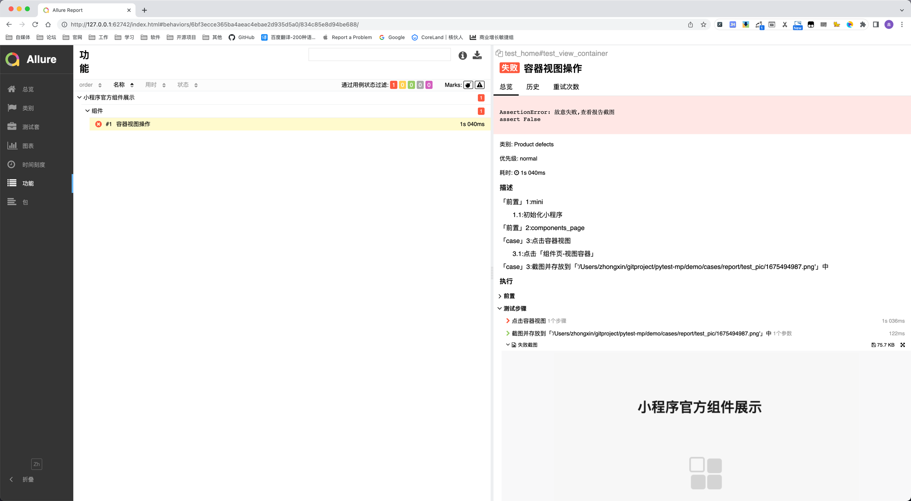
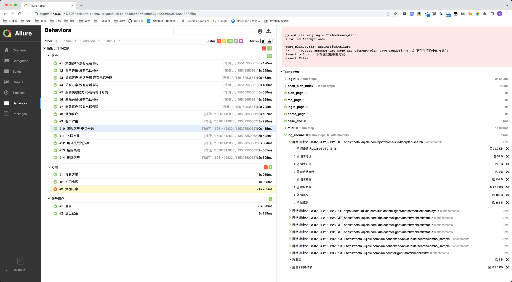

# pytest-mini

> 微信小程序自动化测试pytest插件/工具
> 
> 基于[MiniTest](https://minitest.weixin.qq.com/)进行pytest改造

## 使用方法

### 准备测试小程序

根据[miniprogram-demo](https://github.com/wechat-miniprogram/miniprogram-demo)项目介绍运行一次项目

成功运行后关闭

### 安装&更新

```shell
pip install pytest-mini --upgrade
```

### 引入插件

新建`conftest.py`文件

```python
from pytest_mini import plugins

pytest_plugins = plugins(
    "待测试的小程序项目路径",
    "微信开发者工具路径"
)
```
例如`demo/cases/conftest.py`
```python
from pytest_mini import plugins

pytest_plugins = plugins(
    "/Users/zhongxin/github/miniprogram-demo",  # 待测试的小程序项目路径
    "/Applications/wechatwebdevtools.app/Contents/MacOS/cli"  # 微信开发者工具路径
)
```

### 编写页面对象

在`demo/pages/components_page.py`编写元素定位

```python
from pytest_mini import Mini, Locator


class ComponentsPage(Mini):
    view_container = Locator('view', inner_text='视图容器', desc='组件页-视图容器')

```
在`conftest.py`中添加
```python
import pytest
from pages.components_page import ComponentsPage

@pytest.fixture(scope="session")
def components_page(mini):
    yield ComponentsPage(driver=mini.driver)

```

### 编写测试代码
`demo/cases/test_home.py`
```python
import allure

from pytest_mini import compose


@compose(feature="小程序官方组件展示", story="组件", title='容器视图操作')
def test_view_container(components_page):
    with allure.step("点击容器视图"):
        components_page.click(components_page.view_container)
        assert False, "故意失败,查看报告截图"
```

### 编写执行&报告展示脚本
`demo/cases/allure_debug.py`
```python
import os
import pytest
from pytest_mini.constant import Constant

test_cases = ["test_home.py"]  # 执行的脚本

main_list = [
    '-s', '-v',
    *test_cases,
    '--durations=0', '--clean-alluredir',
    '--alluredir', f'{Constant().REPORT_PATH}/allure_results'
]
pytest.main(main_list)
if not os.getenv("BUILD_URL"):
    os.system(f"{Constant.ALLURE_TOOL} serve {Constant().REPORT_PATH}/allure_results")  # 本地执行
```

### 执行测试
运行`allure_debug.py`文件

### 查看报告


